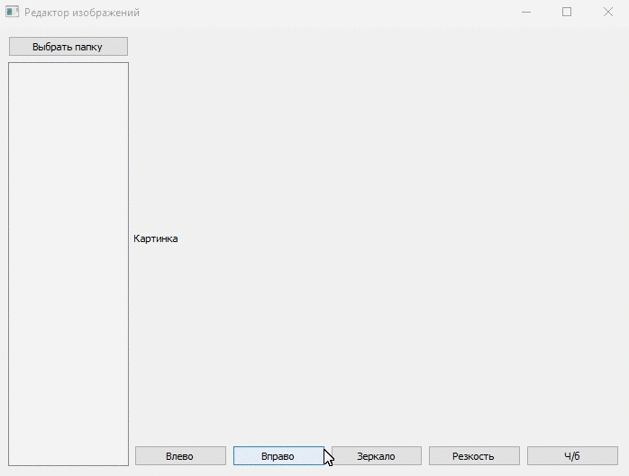

#Редактор изображений
Программа позволяющая редактировать изображения.
Доступыне фильтры:
* чёрно-белый
* размытие
* поворт вправо и влево
* вертикальное зеркало

### Сценарий использования
1. Выбрать папку с изображениями, нажав на соответсвующую кнопку в программе
2. Выбрать из появившегося списка изображение
3. Применить желаемый фильтр

Примечание: к одному изображению применяется один фильтр

Изменённые изображения автоматически сохраняются в папку 'Modified', которая создаётся в выбранно папке

### Пример работы

